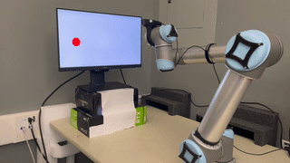

# MaDi for Robotics

This codebase is based on ReLoD: The Remote-Local Distributed System for Real-time Reinforcement Learning on Vision-Based Robotics Tasks.


## Supported Algorithms

- Soft Actor Critic (SAC)
- Reinforcement Learning with Augmented Data (RAD)
- Stabilized Value Estimation under Augmentation (SVEA)
- Masking Distractions (MaDi, our method)


## Robotic Environment

 

The UR-VisualReacher task.


## Installation instructions
1. Download Mujoco and license files to ~/.mujoco
2. Install miniconda or anaconda
3. Create a virtual environment:
```bash
conda create --name myenv python=3.6    # Python 3.6 is necessary
conda activate myenv
```
3. Add the following to ~/.bashrc:
```bash
conda activate myenv
export LD_LIBRARY_PATH=$LD_LIBRARY_PATH:/home/<username>/.mujoco/mjpro210/bin   # Change based on mujoco version
export MUJOCO_GL="egl"  # System specific
```
and run:
```bash
source ~/.bashrc
```
4. Install packages with:
```bash
pip install -r requirements.txt
pip install .
```

## Usage

Train a MaDi agent on UR5-VisualReacher:
```
python task_ur5_visual_reacher.py --algorithm madi --seed 42 --strong_augment overlay 
```
or for the sparse reward setting:
```
python task_ur5_visual_reacher.py --algorithm madi --seed 42 --strong_augment overlay --use_sparse_reward 
```

